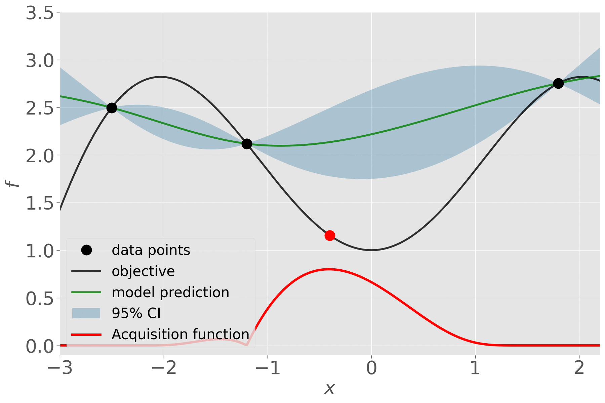

[](https://github.com/wangronin/Bayesian-Optimization/actions)

# Bayesian Optimization Library

A `Python` implementation of the Bayesian Optimization (BO) algorithm working on decision spaces composed of either real, integer, catergorical variables, or a mixture thereof.

Underpinned by surrogate models, BO iteratively proposes candidate solutions using the so-called **acquisition function** which balances exploration with exploitation, and updates the surrogate model with newly observed objective values. This algorithm is designed to optimize **expensive black-box** problems efficiently.



## Installation

You could either install the stable version on `pypi`:

```shell
pip install bayes-optim
```

Or, take the lastest version from github:

```shell
git clone https://github.com/wangronin/Bayesian-Optimization.git
cd Bayesian-Optimization && python setup.py install --user
```

## Example

For real-valued search variables, the simplest usage is via the `fmin` function:

```python
from bayes_optim import fmin

def f(x):
  return sum(x ** 2)

minimum = fmin(f, [-5] * 2, [5] * 2, max_FEs=30, seed=42)
```

And you could also have much finer control over most ingredients of BO, e.g., the surrogate
model and acquisition functions. Please see the example below:

```python
from bayes_optim import BO, RealSpace
from bayes_optim.Surrogate import GaussianProcess

dim = 5
space = RealSpace([-5, 5]) * dim  # create the search space

# hyperparameters of the GPR model
thetaL = 1e-10 * (ub - lb) * np.ones(dim)
thetaU = 10 * (ub - lb) * np.ones(dim)
model = GaussianProcess(                # create the GPR model
  thetaL=thetaL, thetaU=thetaU
)

opt = BO(
    search_space=space,
    obj_fun=fitness,
    model=model,
    DoE_size=5,                         # number of initial sample points
    max_FEs=50,                         # maximal function evaluation
    verbose=True
)
opt.run()
```

For more detailed usage and exmaples, please check out our [wiki page](https://github.com/wangronin/Bayesian-Optimization/wiki).

## Features

This implementation differs from alternative packages/libraries in the following features:

* **Parallelization**, also known as _batch-sequential optimization_, for which several different approaches are implemented here.
* **Moment-Generating Function of the improvment** (MGFI) [WvSEB17a] is a recently proposed acquistion function, which implictly controls the exploration-exploitation trade-off.
* **Mixed-Integer Evolution Strategy** for optimizing the acqusition function, which is enabled when the search space is a mixture of real, integer, and categorical variables.

## Project Structure

* `bayes-optim/SearchSpace.py`: implementation of the search/decision space.
* `bayes-optim/base.py`: the base class of Bayesian Optimization.
* `bayes-optim/AcquisitionFunction.py`: the implemetation of acquisition functions (see below for the list of implemented ones).
* `bayes-optim/Surrogate`: we implemented the Gaussian Process Regression (GPR) and Random Forest (RF).
* `bayes-optim/BayesOpt.py` contains several BO variants:
  * `BO`: noiseless + sequential
  * `ParallelBO`: noiseless + parallel (a.k.a. batch-sequential)
  * `AnnealingBO`: noiseless + parallel + annealling [WEB18]
  * `SelfAdaptiveBO`: noiseless + parallel + self-adaptive [WEB19]
  * `NoisyBO`: noisy + parallel
* `bayes-optim/Extension.py` is meant to include the lastest developments that are not extensively tested:
  * `PCABO`: noiseless + parallel + PCA-assisted dimensionality reduction [RaponiWBBD20] **[Under Construction]**
  * `MultiAcquisitionBO`: noiseless + parallelization with multiple different acquisition functions **[Under Construction]**

<!-- * `optimizer/`: the optimization algorithm to maximize the infill-criteria, two algorithms are implemented:
      1. **CMA-ES**: Covariance Martix Adaptation Evolution Strategy for _continuous_ optimization problems.
      2. **MIES**: Mixed-Integer Evolution Strategy for mixed-integer/categorical optimization problems. -->

## Acquisition Functions

The following infill-criteria are implemented in the library:

* _Expected Improvement_ (EI)
* Probability of Improvement (PI) / Probability of Improvement
* _Upper Confidence Bound_ (UCB)
* _Moment-Generating Function of Improvement_ (MGFI)
* _Generalized Expected Improvement_ (GEI) **[Under Construction]**

For sequential working mode, Expected Improvement is used by default. For parallelization mode, MGFI is enabled by default.

## Surrogate Model

The meta (surrogate)-model used in Bayesian optimization. The basic requirement for such a model is to provide the uncertainty quantification (either empirical or theorerical) for the prediction. To easily handle the categorical data, __random forest__ model is used by default. The implementation here is based the one in _scikit-learn_, with modifications on uncertainty quantification.

## A brief Introduction to Bayesian Optimization

Bayesian Optimization [Moc74, JSW98] (BO) is a sequential optimization strategy originally proposed to solve the single-objective black-box optimiza-tion problem that is costly to evaluate. Here, we shall restrict our discussion to the single-objective case. BO typically starts with sampling an initial design of experiment (DoE) of size, X={x<sub>1</sub>,x<sub>2</sub>,...,x<sub>n</sub>}, which is usually generated by simple random sampling, Latin Hypercube Sampling [SWN03], or the more sophisticated low-discrepancy sequence [Nie88] (e.g., Sobol sequences). Taking the initial DoE X and its corresponding objective value, Y={f(x<sub>1</sub>), f(x<sub>2</sub>),..., f(x<sub>n</sub>)} ⊆ ℝ, we proceed to construct a statistical model M describing the probability distribution of the objective function conditioned onthe initial evidence, namely Pr(f|X,Y). In most application scenarios of BO, there is a lack of a priori knowledge about f and therefore nonparametric models (e.g., Gaussian process regression or random forest) are commonly chosen for M, which gives rise to a predictor f'(x) for all x ∈ X and an uncertainty quantification s'(x) that estimates, for instance, the mean squared error of the predic-tion E(f'(x)−f(x))<sup>2</sup>. Based on f' and s', promising points can be identified via the so-called acquisition function which balances exploitation with exploration of the optimization process.

<!-- Bayesian optimization is __sequential design strategy__ that does not require the derivatives of the objective function and is designed to solve expensive global optimization problems. Compared to alternative optimization algorithms (or other design of experiment methods), the very distinctive feature of this method is the usage of a __posterior distribution__ over the (partially) unknown objective function, which is obtained via __Bayesian inference__. This optimization framework is proposed by Jonas Mockus and Antanas Zilinskas, et al.

Formally, the goal is to approach the global optimum, using a sequence of variables:
$$\mathbf{x}_1,\mathbf{x}_2, \ldots, \mathbf{x}_n \in S \subseteq \mathbb{R}^d,$$
which resembles the search sequence in stochastic hill-climbing, simulated annealing and (1+1)-strategies. The only difference is that such a sequence is __not__ necessarily random and it is actually deterministic (in principle) for Bayesian optimization. In order to approach the global optimum, this algorithm iteratively seeks for an optimal choice as the next candidate variable adn the choice can be considered as a decision function:
\[\mathbf{x}_{n+1} = d_n\left(\{\mathbf{x}_i\}_{i=1}^n, \{y_i\}_{i=1}^n \right), \quad y_i = f(\mathbf{x}_i) + \varepsilon,\]
meaning that it takes the history of the optimization in order to make a decision. The quality of a decision can be measured by the following loss function that is the optimality error or optimality gap:
$$\epsilon(f, d_n) = f(\mathbf{x}_n) - f(\mathbf{x}^*),\quad \text{in the objective space,}$$
or
$$\epsilon(f, d_n) = ||\mathbf{x}_n - \mathbf{x}^*||,\quad \text{in the decision space,}$$
Using this error measure, the step-wise optimization task can be formulated as:
$$d_n^* = \operatorname{arg\,min}_{d_n}\epsilon(f, d_n)$$
This optimization task requires the full knowledge on the objective function $f$, which is not available (of course...). Alternatively, in Bayesian optimization, it is assumed that the objective function belongs to a function family or _function space_, e.g. $\mathcal{C}^1(\mathbb{R}^d):$ the space of continuous functions on $\mathbb{R}^d$ that have continuous first-order derivatives.

Without loss of generality, let's assume our objective function is in such a function space:
$$f\in \mathcal{C}^1\left(\mathbb{R}^d\right)$$
Then, it is possible to pose a prior distribution of _function_ $f$ in $\mathcal{C}^1\left(\mathbb{R}^d\right)$ (given that this space is also measurable):
$$f \sim P(f)$$
This prior distribution models our belief on $f$ before observing any data samples from it. The likelihood can be obtained by observing (noisy) samples on this function $f$, which is the  joint probability (density) of observing the data set given the function $f$:
$$P(\{\mathbf{x}_i\}_{i=1}^n, \{y_i\}_{i=1}^n | f)$$
Then, using the Bayes rule, the __posterior__ distribution of $f$ is calculated as:
$$\underbrace{P(f | \{\mathbf{x}_i\}_{i=1}^n, \{y_i\}_{i=1}^n)}_{\text{posterior}} \propto \underbrace{P(\{\mathbf{x}_i\}_{i=1}^n, \{y_i\}_{i=1}^n | f)}_{\text{likelihood/evidence}}\underbrace{P(f)}_{\text{prior}}$$
Intuitively, the posterior tells us that how the function $f$ distributes once some data/evidence from it are available. At this point, our knowledge on $f$ is better than nothing, but it is represented as a distribution, containing uncertainties. Therefore, the optimal decision-making task can be tackled by optimizing the expected loss function:
$$
d_n^{BO} = \operatorname{arg\,min}_{d_n}\mathbb{E}\left[\epsilon(f, d_n) \; |\; \{\mathbf{x}_i\}_{i=1}^n, \{y_i\}_{i=1}^n)\right]\\
\quad\quad\quad\;\:= \operatorname{arg\,min}_{d_n}\int_{\mathcal{C}^1\left(\mathbb{R}^d\right)}\epsilon(f, d_n) \mathrm{d} P(f | \{\mathbf{x}_i\}_{i=1}^n, \{y_i\}_{i=1}^n)
$$
In practice, the loss function $\epsilon$ is not used because there is not knowledge on the global optimum of $f$. Instead, the improvement between two iterations/steps (as defined in section $1$) is commonly used. The expectation in Eq.~\ref{eq:infill} is the so-called __infill-criteria__, __acquisition function__ or __selection criteria__. Some commonly used ones are: Expected Improvement (EI), Probability of Improvement (PI) and Upper (lower) Confidence Bound (UCB).

As for the prior distribution, the mostly used one is Gaussian and such a distribution on functions is __Gaussian process__ (random field). It is also possible to consider the Gaussian process as a _surrogate_ or simple a model on the unknown function $f$. In this sense, some other models are also often exploited, e.g. Student's t process and random forest (in SMAC and SPOT). However, the usage of random forest models brings me some additional thinkings (see the following sections).

The same algorithmic idea was re-advertised in the name of "Efficient Global Optimization"" (EGO) by Donald R. Jones. As pointed out in Jone's paper on taxonomy of global optimization methods, the bayesian optimization can be viewed as a special case of a broader family of similar algorithms, that is call "global optimization based on response surfaces", Model-based Optimization (MBO) (some references here from Bernd Bischl) or Sequential MBO. -->

## Reference

* [Moc74] Jonas Mockus. "On bayesian methods for seeking the extremum". In Guri I. Marchuk, editor, _Optimization Techniques, IFIP Technical Conference, Novosibirsk_, USSR, July 1-7, 1974, volume 27 of _Lecture Notes in Computer Science_, pages 400–404. Springer, 1974.
* [JSW98] Donald R. Jones, Matthias Schonlau, and William J. Welch. "Efficient global optimization of expensive black-box functions". _J. Glob. Optim._, 13(4):455–492, 1998.
* [SWN03] Thomas J. Santner, Brian J. Williams, and William I. Notz. "The Design and Analysis of Computer Experiments". _Springer series in statistics._ Springer, 2003.
* [Nie88] Harald Niederreiter. "Low-discrepancy and low-dispersion sequences". _Journal of number theory_, 30(1):51–70, 1988.
* [WvSEB17a] Hao Wang, Bas van Stein, Michael Emmerich, and Thomas Bäck. "A New Acquisition Function for Bayesian Optimization Based on the Moment-Generating Function". In _Systems, Man, and Cybernetics (SMC), 2017 IEEE International Conference on_, pages 507–512. IEEE, 2017.
* [WEB18] Hao Wang, Michael Emmerich, and Thomas Bäck. "Cooling Strategies for the Moment-Generating Function in Bayesian Global Optimization". In _2018 IEEE Congress on Evolutionary Computation_, CEC 2018, Rio de Janeiro, Brazil, July 8-13, 2018, pages 1–8. IEEE, 2018.
* [WEB19] Hao, Wang, Michael Emmerich, and Thomas Bäck. "Towards self-adaptive efficient global optimization". In _AIP Conference Proceedings_, vol. 2070, no. 1, p. 020056. AIP Publishing LLC, 2019.
* [RaponiWBBD20] Elena Raponi, Hao Wang, Mariusz Bujny, Simonetta Boria, and Carola Doerr: "High Dimensional Bayesian Optimization Assisted by Principal Component Analysis". In _International Conference on Parallel Problem Solving from Nature_, pp. 169-183. Springer, Cham, 2020.
